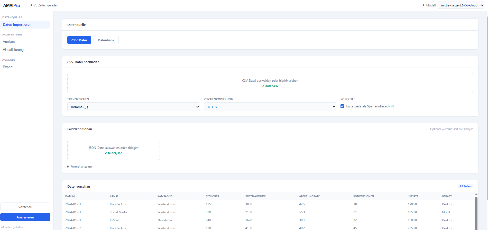
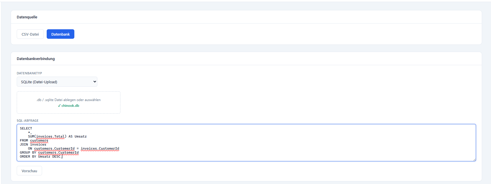
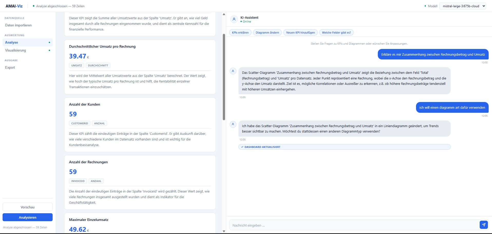
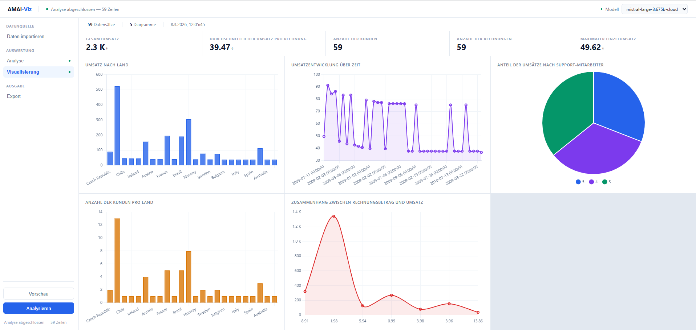
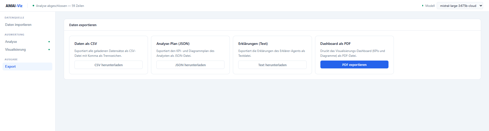

# AMAI Dash

Eine lokale Web-App, die CSV- und Datenbankdaten automatisch analysiert und professionelle Dashboards generiert – angetrieben von KI-Agenten über Ollama.

---

## Screenshots

### CSV importieren


### Datenbank importieren


### Analyse mit KI-Assistent


### Visualisierung (Dashboard)


### Export


---

## Voraussetzungen

- Python 3.11+
- [Ollama](https://ollama.com) lokal installiert und gestartet
- Mindestens ein Sprachmodell in Ollama (empfohlen: `mistral-large-3:675b-cloud`)

---

## Installation

```bash
cd data-visualizer
pip install -r requirements.txt
```

## Starten

```bash
python main.py
```

Dann im Browser öffnen: **http://localhost:8000**

---

## Projektstruktur

```
data-visualizer/
├── main.py                  # FastAPI-App + Routen
├── requirements.txt
├── .gitignore
├── backend/                 # Python-Module
│   ├── agents.py            # KI-Agenten (Analyst, Erklärer, Chat)
│   ├── helpers.py           # CSV / DB / JSON-Hilfsfunktionen
│   └── writer.py            # Output-Generierung (vis-logic.json etc.)
├── static/                  # Frontend
│   ├── index.html           # App-Struktur
│   ├── style.css            # Styles
│   ├── app.js               # App-Logik
│   └── vis-engine.js        # Dashboard-Engine (standalone)
├── output/                  # Generiert bei jeder Analyse (nicht in Git)
│   ├── index.html           # Standalone-Dashboard
│   ├── vis-logic.json       # KPI- und Diagrammregeln
│   └── vis-data.json        # Rohdaten
└── beispiele/               # Beispieldatensätze
    ├── 01_verkauf/
    ├── 02_personal/
    └── 03_webanalyse/
```

---

## Verwendung

### 1 · Daten importieren

- **CSV**: Datei ablegen, Trennzeichen und Kodierung wählen
- **Datenbank**: Typ wählen (SQLite, PostgreSQL, MySQL, SQL Server), Verbindung und SQL-Abfrage eingeben
- Optional: **Felddefinitionen** (JSON) hochladen — verbessert die KI-Analyse
- **Vorschau** zeigt die ersten 10 Zeilen
- **Analysieren** startet die KI-Pipeline

### 2 · Analyse

Zeigt alle KPIs und Diagramme mit Erklärungen.
Rechts befindet sich der **KI-Assistent** — er kann:
- KPIs und Diagramme erklären
- Den Visualisierungsplan auf Anfrage anpassen (Typ ändern, neuen KPI hinzufügen usw.)

### 3 · Visualisierung

Das fertige Dashboard wird als interaktives Chart.js-Dashboard in einem eingebetteten Frame angezeigt:

```
┌────────┬────────┬────────┐
│  KPI 1 │  KPI 2 │  KPI 3 │  ← KPI-Leiste
├────────┴────────┴────────┤
│  Diagramm 1 │ Diagramm 2 │  ← Chart-Grid (dynamisch)
│  Diagramm 3 │ Diagramm 4 │
└──────────────────────────┘
```

### 4 · Export

| Format | Inhalt |
|--------|--------|
| CSV | Alle geladenen Datensätze |
| JSON | Analyse-Plan (KPIs + Diagramme) |
| Text | Erklärungen des Erklärer-Agents |
| PDF | Dashboard als Druckausgabe |

---

## KI-Agenten

| Agent | Aufgabe |
|-------|---------|
| **Analyst** | Analysiert Felder & Daten, erstellt den Visualisierungsplan (KPIs + Diagramme) |
| **Erklärer** | Dokumentiert jeden KPI und jedes Diagramm in verständlicher Sprache |
| **Chat-Agent** | Beantwortet Fragen und nimmt Anpassungen am Plan vor |

Alle Agenten verwenden das im Header gewählte Ollama-Modell.

---

## Unterstützte Datenbanken

| Datenbank | Treiber |
|-----------|---------|
| SQLite | Datei-Upload, kein Treiber nötig |
| PostgreSQL | `pip install psycopg2-binary` |
| MySQL / MariaDB | `pip install pymysql` |
| SQL Server (pymssql) | `pip install pymssql` |
| SQL Server (pyodbc) | `pip install pyodbc` + ODBC Driver 17 |

---

## Felddefinitionen (JSON-Format)

Optionale JSON-Datei, die den Agenten die Bedeutung der Spalten erklärt:

```json
{
  "felder": [
    { "name": "umsatz",  "typ": "numerisch", "beschreibung": "Umsatz in Euro" },
    { "name": "region",  "typ": "kategorie", "beschreibung": "Verkaufsregion: Nord, Süd, Ost, West" },
    { "name": "datum",   "typ": "datum",     "beschreibung": "Verkaufsdatum im Format YYYY-MM-DD" }
  ]
}
```

**Erlaubte Typen:** `numerisch`, `kategorie`, `datum`, `id`, `text`

---

## Ollama-Modell wählen

Im Header befindet sich ein Dropdown mit allen installierten Ollama-Modellen. Der farbige Punkt zeigt den Verbindungsstatus:

- **Grün** — Ollama verbunden, Modelle geladen
- **Gelb** — Verbunden, aber Fehler beim Laden
- **Rot** — Ollama nicht erreichbar

---

## Technologie

| Komponente | Technologie |
|------------|-------------|
| Backend | Python, FastAPI, Uvicorn |
| KI / LLM | Ollama (lokal, offline) |
| Diagramme | Chart.js |
| Frontend | HTML, CSS, Vanilla JS |
